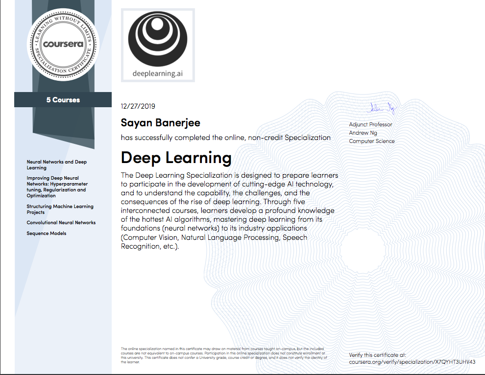

# Deep Learning Specialization
Coding files from deeplearning.ai provided Deep Learning Specialization.

## Neural Networks and Deep Learning

	- Understand the major technology trends driving Deep Learning
	- Be able to build, train and apply fully connected deep neural networks 
	- Know how to implement efficient (vectorized) neural networks 
	- Understand the key parameters in a neural network's architecture
	
## Improving Deep Neural Networks: Hyperparameter tuning, Regularization and Optimization
	- Understand industry best-practices for building deep learning applications. 
	- Be able to effectively use the common neural network "tricks", including initialization, L2 and dropout regularization, Batch normalization, gradient checking, 
	- Be able to implement and apply a variety of optimization algorithms, such as mini-batch gradient descent, Momentum, RMSprop and Adam, and check for their convergence. 
	- Understand new best-practices for the deep learning era of how to set up train/dev/test sets and analyze bias/variance
	- Be able to implement a neural network in TensorFlow.
	
## Convolutional Neural Networks
	- Understand how to build a convolutional neural network, including recent variations such as residual networks.
	- Know how to apply convolutional networks to visual detection and recognition tasks.
	- Know to use neural style transfer to generate art.
	- Be able to apply these algorithms to a variety of image, video, and other 2D or 3D data.
	
## Sequence Models
	- Understand how to build and train Recurrent Neural Networks (RNNs), and commonly-used variants such as GRUs and LSTMs.
	- Be able to apply sequence models to natural language problems, including text synthesis. 
	- Be able to apply sequence models to audio applications, including speech recognition and music synthesis.
	
## Certificate
